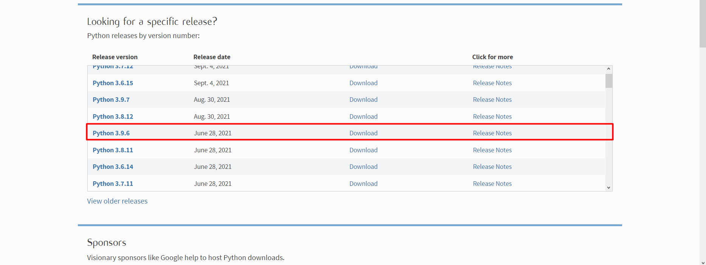
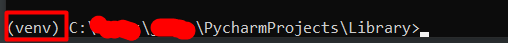
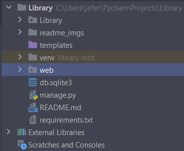

## Projeto Biblioteca

Este projeto foi desenvolvido utilizando o framework Django (Python).
Consiste em ter um CRUD de livros, e também uma sessão onde podemos visualizar se o livro foi emprestado a alguém, e se não fazer então o empréstimo.

Para iniciarmos devemos clonar o repositório, para isto execute o seguinte comando no seu Terminal:

`git clone https://github.com/Jeferson-Peter/UpBiblioteca.git`

Caso você ainda não possuir python em sua máquina acesse [Python.org](https://www.python.org/downloads/) e instale a versão 3.9.6, no qual foi desenvolvido este projeto.



Após feita a instalação, caso não tenho o instalador de pacotes do python e para instalar basta digitar em seu Terminal:
`python get-pip.py`

Após a instalação do gerenciador de pacotes, iremos instalar o pacote virtualenv do python, que usado praticamente em todos os projetos, para que a aplicação não interfira no sistema operacional ou o sistema operacional na aplicação.
Para instalar a virtualenv, digitamos o seguinte comando no Terminal:
`pip install virtualenv`

Para confirmarmos se foi instalado, digitamos:
`virtualenv --version`

Agora criaremos a nossa virtualenv dentro da pasta principal clonada:

`virtualenv <nomeVirtualenv>` => Geralmente usamos `env` ou `venv`.

O próximo passo é ativarmos a virtualenv:

```shell
#LINUX E MAC
source venv/bin/activate

#WINDOWS
venv\Scripts\activate.bat
#OU
venv\Scripts\Activate.ps1
```

Após a ativação da virtualenv, em seu path no Terminal deverá se parecer com isso:



Agora instalaremos todas as dependências até o momento utilizadas, na raiz do projeto, procure por um arquivo chamado `requirements.txt`, e então digite o seguinte comando:
```shell
pip install -r requirements.txt
```

isso instalará todas as dependências.

Após instaladas as dependências, já podemos iniciar o nosso projeto, para isto é necessário executar alguns comandos:



A pasta Library, é onde encontramos as configurações mais importantes do nosso projeto, pois é por ali que acontece toda a comunicação. Mas não precisaremos mexer nela.

Na figura acima, temos o arquivo db.sqlite3 na estrutura do projeto, que não estará no estará no repositório (mas toda vez que é executada a aplicação, ele verifica se existe, se não existe ele cria).

#### Para isto iremos executar uma sequência de comandos:

```shell
python manage.py makemigrations
```

O comando `python manage.py makemigrations` é responsável por criar arquivos de migração para nosso bancos de dados.

#### o Próximo comando a ser executado é:

```shell
python manage.py migrate
```

O comando `python manage.py migrate` é responsável por aplicar essas migrações para o banco de dados.

#### O Próximo comando a ser executado é:

```shell
python manage.py createsuperuser
```

O comando `python manage.py createsuperuser` irá criar um usuário mestre da nossa aplicação, ele irá pedir um usuário, email e senha, mas podemos preencher apenas com um usuário e senha.

#### E por fim o último comando a ser executado é:
```shell
python manage.py runserver
```
 O comando `python manage.py runserver` iniciará a nossa aplicação. Que por padrão roda na 8000. Então para acessar, basta colarmos a seguinte url `http://localhost:8000/` em um browser.

#### A partir deste ponto temos acesso a duas áreas, uma é a área da aplicação com o CRUD de livros e a parte do empréstimo.

Que pode ser acessada através da seguinte URL: `http://localhost:8000/web/listar_books`, onde você poderá visualizar todos os livros cadastrados e consequentemente cadastrar, editar, excluir e consultar os mesmos.

A outra área de acesso é a área administrativa da aplicação, podendo ser acessada pela seguinte URL:`http://localhost:8000/admin`, informe o usuário e a senha criados anteriormente com o comando `python manage.py createsuperuser`, e terá acesso a área administrativa da aplicação.

#### Qualquer contribuição será Bem-vinda.

Developed By Jeferson Peter